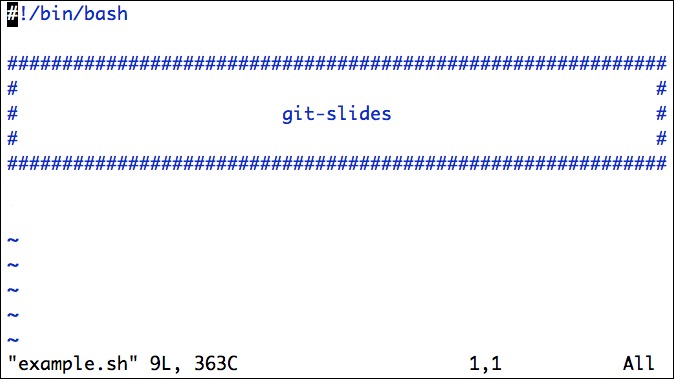

git-slides
==========

Text-based slides using vim and git.

Overview
--------

Abuse git's history rewriting mechanism by creating one commit for each slide.

Within vim, press Space and Backspace (in normal mode) to move forwards and backwards.

Especially useful for live demos with a lot of canned code, which you want to present and run incrementally.

Installation
------------

Copy `plugin/git-slides.vim` to your `~/.vim/plugin`
folder, and put `bin/git-slides` somewhere on your path.
